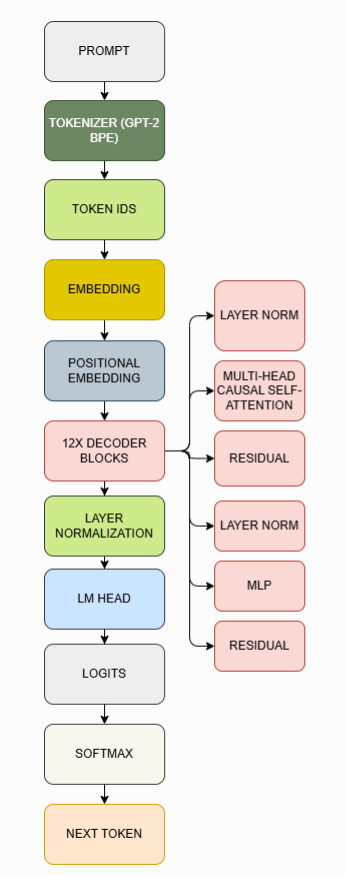

# GPT From Scratch

A decoder-only GPT-style Transformer implemented entirely from scratch using PyTorch.

This project reproduces the core GPT architecture without relying on high-level libraries such as Hugging Face Transformers. Every major component, including token embeddings, causal self-attention, decoder blocks, training, and autoregressive text generation, is implemented manually for educational purposes.



---

## Features

- Decoder-only Transformer (GPT-style)
- Multi-Head Causal Self-Attention
- Learned Token Embeddings
- Learned Positional Embeddings
- Feed Forward Network (MLP with GELU)
- Residual Connections
- Layer Normalization (Pre-LN)
- Autoregressive Text Generation
- GPT-2 Tokenizer (tiktoken)
- AdamW Optimizer
- Model Checkpoint Saving
- GPU Training Support (CUDA)

---

## Project Structure

```text
.
├── config.py
├── gpt_data.py
├── gpt_model.py
├── train.py
├── generate.py
├── requirements.txt
├── README.md
├── outputs/
│   └── sample_generation.txt
└── images/
    └── Architecture.png
```

---

## Model Configuration

| Parameter | Value |
|-----------|------:|
| Vocabulary Size | 50,257 |
| Embedding Size | 768 |
| Number of Layers | 12 |
| Number of Heads | 12 |
| Context Length | 128 |
| Dropout | 0.1 |
| Optimizer | AdamW |

---

## Dataset

The model is trained on the WikiText-2 dataset.

Tokenization is performed using the GPT-2 Byte Pair Encoding tokenizer (`tiktoken`).

---

## Training

Run training with

```bash
python train.py
```

Model checkpoints are automatically saved after every epoch.

---

## Text Generation

Generate text using

```bash
python generate.py
```

Example:

```python
output = generate("Once upon a time", 100)
print(output)
```

---

## Sample Output

Example generations produced by the trained model are available in

```text
outputs/sample_generation.txt
```

---

## Future Improvements

- Weight Tying
- Temperature Sampling
- Top-k Sampling
- Top-p (Nucleus) Sampling
- KV Cache
- Rotary Positional Embeddings (RoPE)
- Flash Attention
- RMSNorm
- SwiGLU
- Mixed Precision Training

---

## Acknowledgements

This project is inspired by:

- GPT-1 (OpenAI)
- GPT-2 (OpenAI)
- Attention Is All You Need
- Andrej Karpathy's educational materials

---