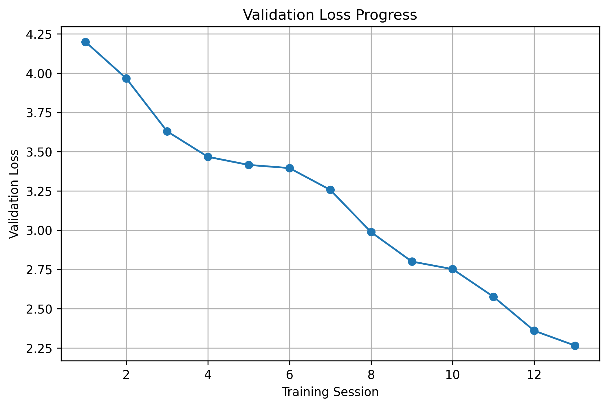

# GPT From Scratch

<p align="center">


</p>

A modern **GPT-style Decoder-Only Transformer** implemented completely from scratch using **PyTorch**.

The primary goal of this project is educational: understanding how modern Large Language Models work by implementing every important component manually instead of relying on high-level frameworks.

Unlike a minimal GPT implementation, this project gradually evolves toward a modern LLM architecture by integrating many techniques used in today's production models.

---

# Project Goals

Instead of using an existing implementation, every major component is built manually:

- Decoder-only Transformer
- Multi-Head Causal Self Attention
- Rotary Position Embeddings (RoPE)
- Flash Attention
- RMSNorm
- SwiGLU Feed Forward Network
- KV Cache
- Weight Tying
- Mixed Precision Training
- Checkpoint Resume
- Hugging Face Export

The repository is designed as a learning project that grows version by version, with each release introducing a new architectural improvement.

The focus is on readability, educational value, and understanding how modern GPT models are implemented under the hood.
---

# Architecture

<p align="center">


</p>

Current architecture:

```
Input Tokens
      │
Token Embedding
      │
RoPE
      │
────────────────────────────────────
× 12 Decoder Blocks
────────────────────────────────────
    RMSNorm
    ↓
    Multi-Head Causal Self Attention
    ↓
    Flash Attention (SDPA)
    ↓
Residual Connection
    ↓
    RMSNorm
    ↓
    SwiGLU Feed Forward
    ↓
Residual Connection
────────────────────────────────────
      │
Final RMSNorm
      │
Weight Tied LM Head
      │
Vocabulary Logits
```

---

# Features

## Transformer Architecture

- Decoder-only GPT architecture
- Multi-Head Causal Self Attention
- Rotary Position Embeddings (RoPE)
- Flash Attention (PyTorch SDPA)
- RMSNorm
- SwiGLU Feed Forward Network
- Residual Connections
- Weight Tying
- KV Cache for fast autoregressive generation

---

## Training Pipeline

- AdamW Optimizer
- Warmup + Cosine Learning Rate Scheduler
- Automatic Mixed Precision (AMP)
- Gradient Clipping
- Validation Split
- Validation Loss
- Perplexity Evaluation
- Resume Training
- torch.compile() acceleration
- Automatic checkpoint saving
- Best model tracking

---

## Dataset Pipeline

- WikiText-2
- GPT-2 BPE tokenizer (`tiktoken`)
- Dataset cleaning
- Sliding-window sample generation
- Configurable stride
- Automatic train / validation split

---

## Text Generation

Supports multiple decoding strategies:

- Greedy Decoding
- Temperature Sampling
- Top-k Sampling
- Top-p (Nucleus) Sampling
- KV Cache accelerated inference

---

## Hugging Face Integration

The project includes a custom Hugging Face wrapper without modifying the original implementation.

Supported features:

- `save_pretrained()`
- `from_pretrained()`
- `AutoModelForCausalLM`
- SafeTensors export
- Custom configuration class
- Custom modeling class

This allows the original implementation to remain independent while still being compatible with the Hugging Face ecosystem.

---

# Feature Checklist

| Component | Status |
|------------|:------:|
| Decoder-only GPT | ✅ |
| Multi-Head Causal Self Attention | ✅ |
| Rotary Position Embeddings (RoPE) | ✅ |
| Flash Attention | ✅ |
| RMSNorm | ✅ |
| SwiGLU | ✅ |
| Weight Tying | ✅ |
| KV Cache | ✅ |
| GPT-2 Tokenizer | ✅ |
| AMP Training | ✅ |
| Warmup + Cosine Scheduler | ✅ |
| Gradient Clipping | ✅ |
| Validation Loss | ✅ |
| Perplexity | ✅ |
| Resume Training | ✅ |
| Hugging Face Export | ✅ |
| AutoModel Compatibility | ✅ |
| SafeTensors Export | ✅ |

---

# Model Configuration

| Parameter | Value |
|-----------|------:|
| Parameters | ~124M Trainable Parameters |
| Vocabulary Size | 50,257 |
| Layers | 12 |
| Attention Heads | 12 |
| Hidden Size | 768 |
| Context Length | 128 |
| Dropout | 0.1 |
| Optimizer | AdamW |
| Scheduler | Warmup + Cosine |
| Positional Encoding | RoPE |
| Normalization | RMSNorm |
| Feed Forward | SwiGLU |

---

# Project Structure

```text
GPT-From-Scratch/

├── config.py
├── gpt_model.py
├── gpt_data.py
├── train.py
├── generate.py
├── requirements.txt
│
├── HuggingFace/
│   ├── configuration_gpt_fs.py
│   ├── modeling_gpt_fs.py
│   ├── export.py
│   └── __init__.py
│
├── checkpoints/
├── outputs/
├── images/
└── huggingface_model/
```

---

## 📈 Training Progress

The model was trained incrementally using checkpoint resume. The figure below illustrates the validation loss across the most significant training sessions, showing the gradual improvement throughout development.

<p align="center">
  
</p>

The model was trained incrementally using checkpoint resume, allowing continuous optimization while preserving the best-performing weights.

---

# Dataset

The model is trained on the **WikiText-2** dataset.

Tokenization is performed using the GPT-2 Byte Pair Encoding tokenizer provided by **tiktoken**.

Training samples are generated using a configurable sliding-window strategy.

---

# Training

Training can be started with

```bash
python train.py
```

The training pipeline automatically handles:

- Dataset download
- Dataset cleaning
- GPT-2 tokenization
- Sliding-window dataset creation
- Train / Validation split
- Mixed Precision Training (AMP)
- Warmup + Cosine Learning Rate Scheduler
- Validation Loss evaluation
- Perplexity calculation
- Gradient Clipping
- Automatic checkpoint saving
- Resume training from checkpoints
- Best model tracking

### Best Validation Metrics:

```text
Validation Loss : 2.2648
Perplexity      : 9.63
```

---

# Text Generation

Generate text using

```bash
python generate.py
```

Example:

```python
output = generate(
    "The king was",
    max_new_tokens=200,
    temperature=0.8,
    top_k=50,
    top_p=0.9,
)

print(output)
```

Generation supports:

- Greedy Decoding
- Temperature Sampling
- Top-k Sampling
- Top-p (Nucleus) Sampling
- KV Cache acceleration

---

# Sample Generations

Example generations are available in

```text
outputs/sample_generation.txt
```

The file contains multiple examples using different decoding strategies, including:

- Greedy decoding
- Temperature sampling
- Top-k sampling
- Top-p sampling
- Combined decoding strategies

---

# Exporting to Hugging Face

Export the trained checkpoint using

```bash
python HuggingFace/export.py
```

The exported model can then be loaded directly with Transformers:

```python
from transformers import AutoModelForCausalLM

model = AutoModelForCausalLM.from_pretrained(
    "Kutlay07/GPT-From-Scratch",
    trust_remote_code=True
)
```

The export produces:

- SafeTensors weights
- Hugging Face configuration
- Generation configuration
- Custom modeling implementation

without modifying the original GPT implementation.

---

# Roadmap

## Completed

### Core Architecture

- Decoder-only GPT
- Multi-Head Causal Self Attention
- RoPE
- Flash Attention
- RMSNorm
- SwiGLU
- Weight Tying
- KV Cache

### Training

- AMP
- Warmup + Cosine Scheduler
- Validation Pipeline
- Perplexity
- Gradient Clipping
- Checkpoint Resume
- torch.compile()

### Inference

- Greedy Decoding
- Temperature Sampling
- Top-k
- Top-p
- KV Cache

### Hugging Face

- Export Pipeline
- AutoModel Compatibility
- SafeTensors Export
- save_pretrained()
- from_pretrained()

---

## Planned Improvements

The long-term goal is to continue modernizing the architecture by implementing additional techniques used in recent LLMs.

Planned features include:

- Grouped Query Attention (GQA)
- Sliding Window Attention
- Quantization
- LoRA Fine-tuning
- Longer Context Length
- Vision Encoder
- Multimodal Support
- Larger-scale pretraining

---

# Version History

## v1.3.0 — Hugging Face Integration

### Added

- RMSNorm
- SwiGLU Feed Forward Network
- KV Cache
- Warmup + Cosine Learning Rate Scheduler
- Hugging Face Export
- AutoModelForCausalLM compatibility
- SafeTensors export
- Custom Hugging Face wrapper

### Improved

- Faster autoregressive inference
- Modernized architecture
- Cleaner project structure
- Full Hugging Face compatibility

---

## v1.2.0 — Modern LLM Architecture

### Added

- Rotary Position Embeddings (RoPE)
- Flash Attention (PyTorch SDPA)
- Automatic Mixed Precision (AMP)
- Gradient Clipping
- Validation Split
- Validation Loss
- Perplexity
- Resume Training
- torch.compile()

### Improved

- Training stability
- GPU memory efficiency
- Faster attention computation
- Better checkpoint compatibility

---

## v1.1.0 — Training Improvements

### Added

- Weight Tying
- Temperature Sampling
- Top-k Sampling
- Top-p Sampling
- Dataset Cleaning
- Sliding Window Dataset
- Improved Checkpoint Management

---

## v1.0.0 — Initial Release

Initial implementation including:

- Decoder-only GPT
- Multi-Head Causal Self Attention
- Training Pipeline
- Text Generation

---

# References

This project is inspired by:

- Attention Is All You Need (Vaswani et al.)
- OpenAI GPT-1
- OpenAI GPT-2
- RoFormer
- FlashAttention
- Hugging Face Transformers
- Andrej Karpathy's educational materials

---

# License

This project is licensed under the MIT License.

---

If you found this project helpful, consider giving it a ⭐ on GitHub.